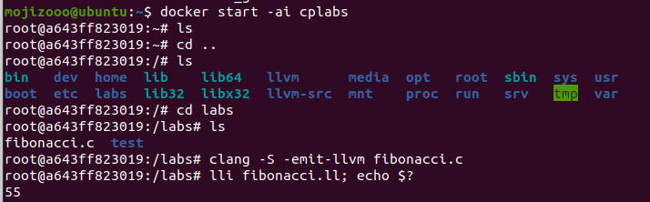

# Lab0 实验报告

林宸昊 PB20000034

## 实验要求

1. 使用 Docker 镜像搭建实验环境
2. 配置 GitLab, Git

## 实验任务

1. 成功搭建实验环境的截图
- 此处将complier-labs重命名为cplabs；

1. 对 Docker 的理解：
- docker是一个容器引擎，用来管理和运行容器；
- docker所管理和运行的容器可以看做是一种加了隔离机制的进程：这种进程既不互相影响，也不会影响宿主机，并且利用docker可以创建多个容器互不干扰的运行；
- docker同时还能给容器提供镜像，使得容器无需在宿主机系统上启动，而是基于镜像。镜像包含了安装后的程序和所依赖的一切文件；
- 容器所采用的的沙箱机制使得开发者可以将他们的应用打包到这样的容器中，然后发布到任何机器或者平台上，并且可以无视所存在的机器或平台实现完全一样的效果，就像一个内部完整的集装箱——只会被运送，而其内容与所处地无关，不同集装箱之间没有联系。
## 实验反馈（可选）

无