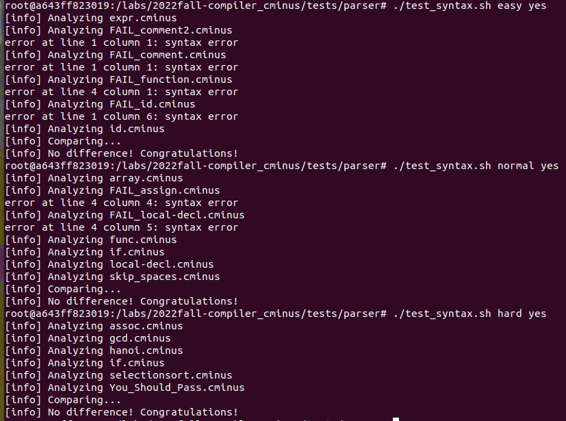
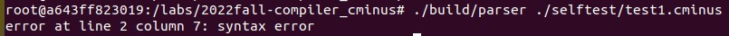
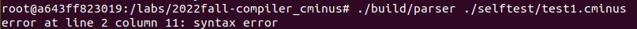
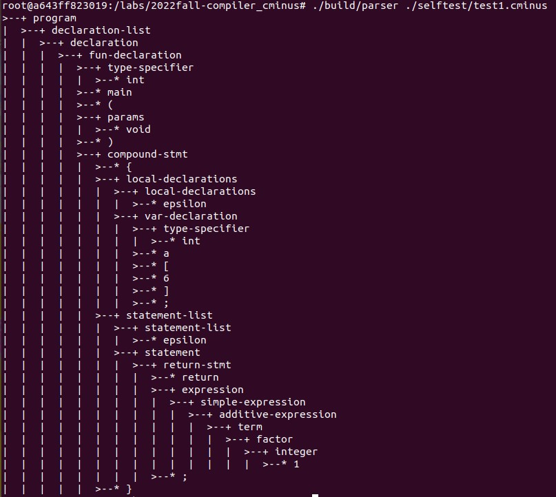

# lab1 实验报告
学号：PB20000034
姓名：林宸昊

## 实验要求
- 修改lexical_analyzer.l和syntax_analyzer.y文件，完善语法分析器和词法分析器，能够分析简单的cminus-f文件；
- 撰写实验报告；
- 通过git提交。

## 实验难点
### 1.看懂实验文档
- 首先需要理解本次实验需要做什么——通过语法分析器与词法分析器的配合，先取出cminus-f文件中所有的token，然后根据语法分析器生成一棵语法分析树；
- 了解这个基本过程之后就可以开始着手。先确定token，确定token后再确定文法对应的type，最后给出对应词法规则，即先写.y再写.l；
### 2.具体实现
- 理解一些重要函数的作用如
  ```c
  syntax_tree_node *node(const char *name, int children_num, ...);
  //生成一个名称为name，带有children_num个子结点的结点以接在语法数上
  void pass_node(char *text);
  //通过yylval在lexer里设置某个token的值
  ```
  以及特殊标识符如
  ```
  $$ $1 $2
  //$$ 代表的就是当前结点，而后续所跟的$1, $2则通过node函数按顺序分配对应标识符（type）
  ```
  等的使用方法。
- 理解flex和bison的基本写法。其实flex所写就同书上通过字符集构造对应词语的方法一样，包括但不限于
  ```
  | + *
  ```
  等符号都是通用的，而bison则如书上的文法书写一致，只不过将→换成：；
- 除此之外其实难点在于一些细节部分，比如对于注释的处理——通过怎样的词法规则能够囊括所有的注释类型；
- 理解上述难点之后，剩下的就是一些重复性较高的组织工作了。

## 实验设计
按照先写.y后写.l的顺序——
### 语法分析器
- 首先确定union——即所有结点对应的语义值。查看pass_node以及node函数都指向（提示）了头文件syntax_tree.h中定义的一个结构体：
```c
struct _syntax_tree_node {
    struct _syntax_tree_node * parent;      //当前结点
    struct _syntax_tree_node *children[10]; //子结点指针数组以及最多存在的子结点数目
    int children_num;                       //子结点数目
    char name[30];                          //当前结点名称
}
```
即提示了union中应当给予YYSTYPE怎样的定义。

    %union {struct syntax_tree_node * node;}

- 确定了union后则可以开始按照实验文档所给出的字符集以及语法规则确定token和type，此处不再赘述。需要注意的是float, FLOAT, FLOATPOINT的区分——float是type类型的标识符，FLOAT是关键字，FLOATPOINT代表的是具体的浮点数。
```c
%token <node> ELSE IF INT RETURN VOID WHILE FLOAT
......
%type <node> type-specifier relop addop mulop
......
%start program
```
- 确定了token和type之后就可以根据文档所给书写规则，根据给出的program的例子可以很容易依葫芦画瓢：
```c
declaration-list : declaration-list declaration {$$ = node("declaration-list", 2, $1, $2);} | declaration {$$ = node("declaration-list", 1, $1);}
......
```
需要注意的是，对于empty, 直接使用epsilon-空输入方法，并将node函数中的孩子数目改为0。
至此，语法分析器构建完成。
### 2.词法分析器
- 由于pos_start以及pos_end的维护仅供debug使用，此处不加赘述，根据所给出的例子：
  ```c
  \+ {pass_node(yytext); return ADD;}
  ```
  对于关键字可以同样依葫芦画瓢：
  ```c
  \>= {pass_node(yytext); return GTE;}
  ......
  else {pass_ndoe(yytext); return ELSE;}
  ......
  [a-zA-Z]+ {pass_node(yytext); return ID;} //此处+即为正闭包
  [0-9]+ {pass_node(yytext); return INT;}
  ([0-9]+\.|[0-9]*\.[0-9]+) {pass_node(yytext); return FLOATPOINT;}//实验文档所给构造方法，*即为闭包
  ```
  除此之外还有一些特殊字符，需要进行特殊处理：
  ```c
  \n {pass_node(yytext);} //回车没有返回值，且由于使用的是linux系统故无需考虑\r
  " "|\t {pass_node(yytext);} //空格或者制表符，参见文档所给例子
  \/\*([^\*]|(\*)*[^\*/])*(\*)*\*\/ {pass_node(yytext);}
  ```
  注释的处理可以分解成

        \/\* （ [^\*] | (\*)* [^\*/] )* (\*)* \*\/
        首尾两段自不必说，首先[^\*]代表所有非\*的内容，因此中间这部分其实就是代表所有非*的内容，以及*后面不是*和/的部分——因为一旦出现这部分，则会直接与开头匹配从而出现错误判断。在处理完这部分内容后，*可以无限出现（因为已没有注释内容），直到遇到最后的*/。
    最后再加上
    ```c
    . {return ERROR;} //遇到其他字符时直接报错。
    ```
    至此，词法分析器构建完成。
## 实验结果验证
- 文档所给出的测试样例的测试结果：
  

- 文档所给出的测试样例已较为完备，此处给出三项自编测试：
- 未收录的字符
  ```c
  int main(void){
    int c`;
    return 1;
  }
  ```
  测试结果：
  
- 未被cminus-f认可的文法
  ```c
  int main(void){
    int a[5] = {1, 2, 3, 4, 5};
    return 0;
  }
  ```
  测试结果：
  
- 复杂的注释
  ```c
  \****
  **dsada**
  **dsa//
  */
  int main(void){
    int a[6];
    return 1;
  }
  ```
  测试结果：
  
  可见，测试结果均符合预期，可以近似认为本次实验结果正确（因为还有隐藏测试用例）。
## 实验反馈
- 也许实验文档中使用的例子可以更贴近于需要实现的内容。比如给出简单的几条文法和相应的字符集，然后通过bison和flex给出某个样例的分析树。实验文档所给的例子和需要完成的目标乍一看就给人一种“现在你已经知道了基本操作那么开始制作一个编译器吧!”这种感觉，来回看了好几遍才弄懂该如何下手；
- 然后在搞懂应该怎么做以及还有所给出的例子时，剩下的变成了类似打字员的工作，上一秒还在研究深奥的文档，下一秒开始ctrlc+ctrlv，有那么一点点割裂。但是还是可以接受的程度，总体算是不错的入门。