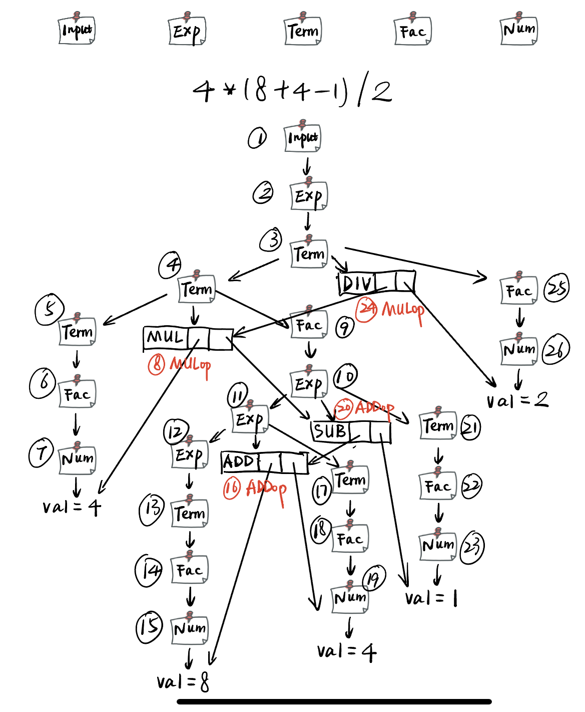

# lab2 实验报告
学号：PB20000034

姓名：林宸昊

## 问题1: getelementptr
请给出 `IR.md` 中提到的两种 getelementptr 用法的区别,并稍加解释:
  - `%2 = getelementptr [10 x i32], [10 x i32]* %1, i32 0, i32 %0`

  	转换成c语言应为
  	`%2 = %1[0][%0];`
  - `%2 = getelementptr i32, i32* %1 i32 %0`

  	转换成c语言应为
  	`%2 = %1[%0];`
  - 区别在于，一个用于单一元素的指针，如`i32* %1`；另一个则一般用于多位数组或是结构体或是其他类似数据结构，第一个参数代表以目标指针地址为起点，指针所指元素类型为单位的偏移，而第二个参数则代表指针偏移完成后从该指针内部第一个元素为起点，内部元素为单位的偏移。事实上偏移参数可以有多个，如：

  	```llvm
  	@MyVar = external global {i32, [40 x i32]}
  	...
  	%idx = getelementptr {[40 x i32]}, ptr @MyVar, i64 0, i32 1, i64 17
  	```
  	即首先根据第一个参数对MyVal进行偏移，然乎再从结构体内部开始偏移`i32 1`，偏移`i64 17`到达`[40 x i32]`的第18个元素。

## 问题2: cpp 与 .ll 的对应
请说明你的 cpp 代码片段和 .ll 的每个 BasicBlock 的对应关系。
### assign
- 生成的ll代码
	``` llvm
	define i32 @main() {	;
	label_bb:
  		%op0 = alloca [10 x i32]
  		%op1 = getelementptr [10 x i32], [10 x i32]* %op0, i32 0, i32 0
  		store i32 10, i32* %op1
  		%op2 = load i32, i32* %op1
  		%op3 = mul i32 %op2, 2
  		%op4 = getelementptr [10 x i32], [10 x i32]* %op0, i32 0, i32 1
  		store i32 %op3, i32* %op4
  		%op5 = load i32, i32* %op4
  		ret i32 %op5
	}
	```
- 对应cpp代码
	```cpp
	auto mainFun = Function::create(FunctionType::get(Int32Type, {}), "main", module);
  	auto bb = BasicBlock::create(module, "bb", mainFun);
  	builder->set_insert_point(bb);			//label_bb:
  	...
  	auto ret = builder->create_load(a1);
  	builder->create_ret(ret);				//ret i32 %op5
  											//main basicblock ends
  ```
### fun
- 生成的ll代码：
	```llvm
	define i32 @callee(i32 %arg0) {
	label_entry:
  		%op1 = alloca i32
  		store i32 %arg0, i32* %op1
  		%op2 = load i32, i32* %op1
  		%op3 = mul i32 2, %op2
  		ret i32 %op3
	}
	define i32 @main() {
	label_entry:
  		%op0 = call i32 @callee(i32 110)
  		ret i32 %op0
	}
	```
- 对应的cpp代码：
	```cpp
	std::vector<Type *> Ints(1, Int32Type);
  	
  	auto calleeFunTy = FunctionType::get(Int32Type, Ints);
  	auto calleeFun = Function::create(calleeFunTy, "callee", module);
  	
  	auto bb = BasicBlock::create(module, "entry", calleeFun);
  	builder->set_insert_point(bb);					//callee bb begins
	...
	auto mul = builder->create_imul(CONST_INT(2), a);
  	builder->create_ret(mul);						//callee bb ends
  	
  	auto mainFun = Function::create(FunctionType::get(Int32Type, {}), "main", module);
  	bb = BasicBlock::create(module, "entry", mainFun);
  	builder->set_insert_point(bb);					//main bb begins
  	...
  	auto ret = builder->create_call(calleeFun, {CONST_INT(110)});
  	builder->create_ret(ret);						//main bb ends
  ```
### if
- 生成的ll代码：
	```llvm
	define i32 @main() {
	label_entry:
  		%op0 = alloca i32
  		%op1 = alloca float
  		store float 0x40163851e0000000, float* %op1
  		%op2 = load float, float* %op1
  		%op3 = fcmp ugt float %op2,0x3ff0000000000000
  		br i1 %op3, label %label_true_bb, label %label_false_bb
	label_ret_bb:                                                ; preds = %label_true_bb, %label_false_bb
  		%op4 = load i32, i32* %op0
  		ret i32 %op4
	label_true_bb:                                                ; preds = %label_entry
  		store i32 233, i32* %op0
  		br label %label_ret_bb
	label_false_bb:                                                ; preds = %label_entry
  		store i32 0, i32* %op0
  		br label %label_ret_bb
	}
	```
- 对应cpp代码：
	```cpp
	auto mainFun = Function::create(FunctionType::get(Int32Type, {}),
                                  "main", module);
  	auto bb = BasicBlock::create(module, "entry", mainFun);
  	builder->set_insert_point(bb);		//main bb begins
  	auto ret_bb = BasicBlock::create(module, "ret_bb", mainFun);
  	auto true_bb = BasicBlock::create(module, "true_bb", mainFun);
  	auto false_bb = BasicBlock::create(module, "false_bb", mainFun);	//define other three bbs
  	auto br = builder->create_cond_br(fcmp, true_bb, false_bb);	//main bb ends
  	builder->set_insert_point(true_bb);			//true bb begins
  	builder->create_store(CONST_INT(233), ret);
  	builder->create_br(ret_bb);					//true bb ends
  	builder->set_insert_point(false_bb);		//false bb begins
  	builder->create_store(CONST_INT(0), ret);
  	builder->create_br(ret_bb);					//false bb ends
  	builder->set_insert_point(ret_bb);			//ret bb begins
  	auto fin_ret = builder->create_load(ret);
  	builder->create_ret(fin_ret);				//ret bb ends
  ```
### while
- 生成的ll代码：
	```llvm
	define i32 @main() {
	label_entry:
  		%op0 = alloca i32
  		%op1 = alloca i32
  		store i32 10, i32* %op0
  		store i32 0, i32* %op1
  		br label %label_cmp
	label_cmp:                                                ; preds = %label_entry, %label_while
  		%op2 = load i32, i32* %op1
  		%op3 = icmp slt i32 %op2, 10
  		br i1 %op3, label %label_while, label %label_ret
	label_while:                                                ; preds = %label_cmp
  		%op4 = load i32, i32* %op1
  		%op5 = add i32 %op4, 1
  		store i32 %op5, i32* %op1
  		%op6 = load i32, i32* %op1
  		%op7 = load i32, i32* %op0
  		%op8 = add i32 %op7, %op6
  		store i32 %op8, i32* %op0
  		br label %label_cmp
	label_ret:                                                ; preds = %label_cmp

 		%op9 = load i32, i32* %op0
 		ret i32 %op9
 	}
 	```
- 对应的cpp代码：
	```cpp
	auto mainFun = Function::create(FunctionType::get(Int32Type,{}), "main", module);
  	auto bb = BasicBlock::create(module, "entry", mainFun);
  	builder->set_insert_point(bb);		//main bb begins
  	auto cmp_bb = BasicBlock::create(module, "cmp", mainFun);
  	auto while_bb = BasicBlock::create(module, "while", mainFun);
  	auto ret_bb = BasicBlock::create(module, "ret", mainFun);	//define other three bbs
  	builder->create_br(cmp_bb);			//main bb ends
  	builder->set_insert_point(cmp_bb);	//cmp_bb begins
  	...
  	builder->create_cond_br(icmp, while_bb, ret_bb);	//cmp_bb ends
  	builder->set_insert_point(while_bb);	//while bb begins
  	...
	builder->create_br(cmp_bb);				//while bb ends
  	builder->set_insert_point(ret_bb);		//ret bb begins
  	auto ret = builder->create_load(a_addr);
  	builder->create_ret(ret);				//ret bb ends
  ```

## 问题3: Visitor Pattern
分析 `calc` 程序在输入为 `4 * (8 + 4 - 1) / 2` 时的行为：
1. 请画出该表达式对应的抽象语法树（使用 `calc_ast.hpp` 中的 `CalcAST*` 类型和在该类型中存储的值来表示），并给节点使用数字编号。
2. 请指出示例代码在用访问者模式遍历该语法树时的遍历顺序。
- 已对节点名称略去共同前缀`CalcAST`， 同时适当缩写方便构图；
- 编号顺序即为遍历顺序。


## 实验难点
### 问题1
- IR指令一般而言对于赋值的操作可以分为三步：`分配空间alloca`->`取地址getelementptr`->`存值store`，需要取用时直接load即可，然后使用IR指令的关键字进行相应运算。整体和x86汇编机器码很像，难度不大，模仿样例即可；值得注意的就是`getelementptr`的使用，在问题1中已详细分析，此处不多赘述；
- 对于条件跳转或者直接跳转，仿照样例文件中的`br`以及`cmp`使用方式即可；
- 值得注意的是，文档也有提到，函数体的定义是会隐式占用一个序号的（如果使用序号对变量进行编号的话），如：
	```llvm
		define i32 @main() #0 {
			%1 = ...;
		}
	```
	即使此处的函数内没有定义变量，0这一序号业已被占用；
- align用于确定分配空间的字节对齐方式，以i32为例，32位整数正好可以使用`align 4`四字节对齐模式，使用`align 8`或是更高的字节对齐方式会自动适配当前所分配空间所需的最小字节数，即`align 4`对于够用，无需采用`align 4`以上的；
- 在给出的gcd_array.ll中出现了`inbounds`这一关键词的使用，官网对此的解释是：
	> The inbounds keyword is designed to describe low-level pointer arithmetic overflow conditions, rather than high-level array indexing rules.
	> With the inbounds keyword, the result value of the GEP is undefined if the address is outside the actual underlying allocated object and not the address one-past-the-end.
	> Without the inbounds keyword, there are no restrictions on computing out-of-bounds addresses. Obviously, performing a load or a store requires an address of allocated and sufficiently aligned memory. But the GEP itself is only concerned with computing addresses.
	
	即用于保证不发生数组越界——可能使用到的索引超出了数组所能描述的范围导致溢出；
- `if.c`出现的浮点数`5.555`不可由IR指令直接识别与处理，需要转换为64位双精度浮点数的二进制形式，即`0x40163851E0000000`（实际写的时候直接参考了生成的这一数字）。
### 问题2
- 初看参考文档可能会对一大堆接口，函数等等云里雾里，但事实上研读后不难发现，与其说是编写cpp文件以生成ll，倒不如说是根据生成的ll来编写cpp文件——builder中的函数都基本与ll文件中的IR指令向对应，只需要多加一些提前的定义（样例中可以直接照搬得到）然后对照需要生成的IR指令转化为对应的函数实现（实际写的时候并未完全按照问题1中编写的ll的逻辑。但不影响最终效果）。
- 一些对应：
	> builder->set_insert_point(bb) -> basicblock 入口
	
	> builder->create_alloca -> alloca
	
	> builder->create_br	 -> br
	
	> builder->create_call	 -> call
	
	> builder->create_gep	 -> getelementptr
	
	> builder->create_load	 -> load 
	
	> builder->create_ret	 -> ret 	...
- 数组类型的获取可以参照Type.h中的定义，也可以参照gcd样例中的示范：
	```cpp
	auto *arrayType = ArrayType::get(Int32Type, 1);		//其中Int32Type也是使用Type::get方法得到的32位整数类型	
	```
	或利用
	```cpp
	static ArrayType *get_array_type(Type *contained, unsigned num_elements);
	```
### 问题3
- 首先确定所包含的数据类型以及内部的一些重要成员：
	```cpp
	struct CalcASTInput 		{std::shared_ptr<CalcASTExpression> expression;};
	struct CalcASTExpression	{std::shared_ptr<CalcASTExpression> expression; AddOp op; std::shared_ptr<CalcASTTerm> term;};
	struct CalcASTNum;			{int val;};
	struct CalcASTTerm;			{std::shared_ptr<CalcASTTerm> term; MulOp op; std::shared_ptr<CalcASTFactor> factor;}
	struct CalcASTFactor;		{}
	```
	其中，每个成员变量中的共享指针在遍历时允许它们向对应的成员进行转换；
	除此之外，每个成员变量都有对应的accept函数，Factor和Input的比较特殊：
	```cpp
	void CalcASTInput::accept(CalcASTVisitor &visitor) { expression->accept(visitor); }
	void CalcASTFactor::accept(CalcASTVisitor &visitor) {
    	auto expr =
        	dynamic_cast<CalcASTExpression *>(this);
    	if (expr) {
    		expr->accept(visitor);
     	  	return;
    	}
	
    	auto num =
        	dynamic_cast<CalcASTNum *>(this);
    	if (num) {
        	num->accept(visitor);
        	return;
    	}
	
    	_AST_NODE_ERROR_
	}
	```
	这两个accept函数则允许`Input`向`Expression`转换，`Factor`向`Num`或`Expression`转换，且前者优先级更高。
- 在获悉基本的数据类型之后，可以转向`calc_ast.cpp`查看基本遍历方式：
	```cpp
	//handle input first
	if (_STR_EQ(n->name, "input")) {...};
	//then handle expression
	else if(_STR_EQ(n->name, "expression") {
		if (n->children_num == 3) {...};	//if expression exists, transform into "expr op term" mode, which means first expr, then opcode, then term
		else {...};							//else tranform into term		
	};
	//then handle term
	else if (_STR_EQ(n->name, "term")) {
		if (n->children_num == 3) {...};	//if term exists, transform into "term op factor" mode
		else {...};							//else transform into factor
	}
	//then handle factor
	else if (_STR_EQ(n->name, "factor")) {
		if (n->children_num == 3) {...};	//back to expression reursively
		else {...};							//else transform into num 
	}
	```
	其实此时整体思路也已经明了，`expression`处理`term`之间的加减，`term`处理`factor`之间的乘除，`factor`处理底层的基本项，如果碰到无法处理的情况，则递归转化为`expression`继续从头处理，直到得到`num`。粗略来看，可以得到这样的语法分析树：
	
	然后再按照`calc_builder.cpp`提供的自顶向下分析方法以及先`l_val`再`r_val`的顺序得到完整的语法树（见问题3回答)。需要注意的是，操作符并不是像`calc_builder.cpp`文件中那样先得到左右值再遍历操作符——此时的整体树已经完成，应该看`calc_ast.cpp`中的构造顺序判明是左->操作符->右的顺序。

## 实验反馈
- 前两题比较简单，还是一些依葫芦画瓢的工作，第三题稍复杂，需要能读懂代码，例如构造语法树时各个节点的children数组的含义等，并且能够根据代码得到完整的遍历顺序；
- 前两次不难，后面的实验应该会死掉吧（悲
